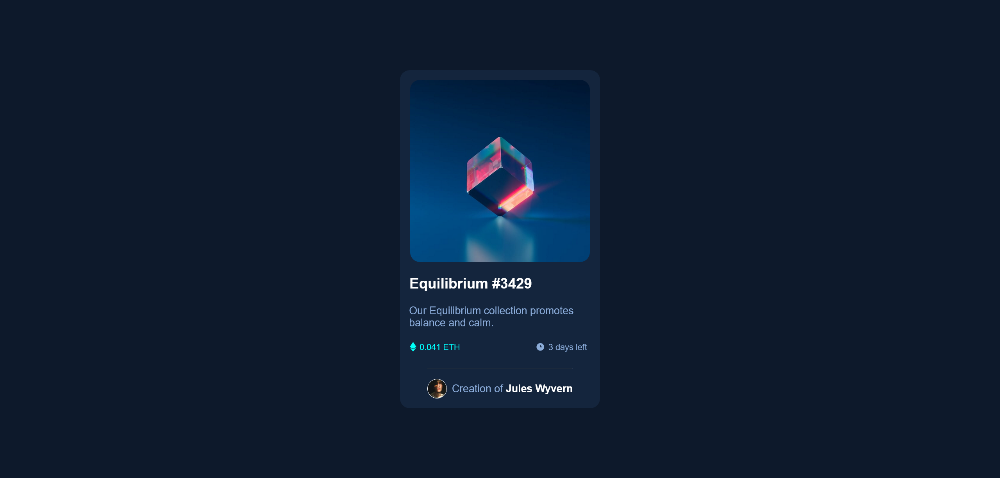

# Frontend Mentor - NFT preview card component solution

This is a solution to the [NFT preview card component challenge on Frontend Mentor](https://www.frontendmentor.io/challenges/nft-preview-card-component-SbdUL_w0U). Frontend Mentor challenges help you improve your coding skills by building realistic projects. 

## Table of contents

- [Overview](#overview)
  - [The challenge](#the-challenge)
  - [Screenshot](#screenshot)
  - [Links](#links)
- [My process](#my-process)
  - [Built with](#built-with)
  - [What I learned](#what-i-learned)
  - [Continued development](#continued-development)
  - [Useful resources](#useful-resources)
- [Author](#author)
- [Acknowledgments](#acknowledgments)

## Overview

### The challenge

Users should be able to:

- View the optimal layout depending on their device's screen size
- See hover states for interactive elements

### Screenshot


 - Screenshot od project..

### Links

- Live Site URL: [Live Server Url](https://prasannapandhare.github.io/NFT-Preview-Card.github.io/)

## My process

### Built with

- Semantic HTML5 markup
- CSS custom properties
- Flexbox

### What I learned

I have learned how to make simple templates using HTML and CSS with help of flex properties .

Observe below code for given project.

```html
<!DOCTYPE html>
<html lang="en">

<head>
    <meta charset="UTF-8">
    <meta name="viewport" content="width=device-width, initial-scale=1.0">
    <link rel="icon" type="image/png" sizes="32x32" href="./images/favicon-32x32.png">
    <title>Frontend Mentor | NFT preview card component</title>
    <link rel="stylesheet" href="style.css">
</head>

<body>
    <div id="wrapper">
        <div class="card">
            <div class="upper">
                
            </div>

            <div class="mid1">
                <p>Equilibrium #3429</p>
            </div>

            <div class="mid2">
                <div class="text">
                    <p>Our Equilibrium collection promotes balance and calm.</p>
                </div>
                <div class="tag">
                    <div class="name">
                        
                        <p>0.041 ETH</p>
                    </div>
                    <div class="time">
                        
                        <p>3 days left</p>
                    </div>
                </div>
            </div>

            <div class="low">
                <hr>
                <div class="man">
                    
                    <p>Creation of <b>Jules Wyvern</b></p>
                </div>
            </div>
        </div>
    </div>

    <div class="attribution">
        Challenge by <a href="https://www.frontendmentor.io?ref=challenge" target="_blank">Frontend Mentor</a>.
        Coded by <a href="#">Prasanna Pandhare</a>.
    </div>
</body>

</html>
```
```css
@import url(https://fonts.google.com/specimen/Outfit);

* {
    margin: 0;
    padding: 0;
    box-sizing: border-box;
    font-family: "Outfit", sans-serif;
    font-weight: 300, 400, 600;
}

#wrapper {
    height: 100vh;
    width: 100%;
    background-color: hsl(217, 54%, 11%);
    display: flex;
    justify-content: center;
    align-items: center;
}

.card {
    height: auto;
    width: 20%;
    background-color: hsl(216, 50%, 16%);
    border-radius: 15px;
    display: flex;
    flex-direction: column;
    align-items: center;
}

.upper {
    height: 40%;
    width: 90%;
    margin: auto;
    border-radius: 15px;
    padding-top: 15px;
}

.image {
    width: 100%;
    height: 100%;
    border-radius: 15px;
    position: relative;
}

.mid1 p {
    font-weight: 600;
    color: white;
    padding-top: 20px;
    padding-right: 90px;
    padding-bottom: 20px;
    display: flex;
    justify-content: flex-start;
    font-size: 22px;
}

.mid2 {
    display: flex;
    flex-direction: column;
}

.text {
    padding-left: 14px;
    color: hsl(215, 51%, 70%);
    font-size: 16px;
}

.tag {
    display: flex;
    justify-content: space-between;
    padding-top: 20px;
    padding-left: 15px;
    padding-right: 15px;
    padding-bottom: 15px;
}

.name {
    display: flex;
    color: cyan;
    font-size: small;
}

.name img {
    width: 10px;
    height: 15px;
}

.name p {
    padding-left: 5px;
}

.time {
    display: flex;
    color: hsl(215, 51%, 70%);
    font-size: small;
}

.time img {
    width: 15px;
    height: 15px;
}

.time p {
    padding-right: 5px;
    padding-left: 5px;
}

.low {
    padding-top: 10px;
    padding-bottom: 15px;
    padding-left: 5px;
    padding-right: 5px;
}

hr {
    border-color: hsl(215, 32%, 27%);
    border-width: 130%;
}

.man {
    display: flex;
    justify-content: left;
    align-items: center;
    padding-top: 15px;

}

.man img {
    width: 30px;
    height: 30px;
    border: 1px solid white;
    border-radius: 50%;
}

.man p {
    padding-left: 8px;
    color: hsl(215, 51%, 70%);
}

.man p b {
    color: white;
}

.image:hover {
    cursor: pointer;
}

.mid1 p:hover {
    color: aqua;
    cursor: pointer;
}

.man p b:hover {
    color: aqua;
    cursor: pointer;
}

.attribution {
    font-size: 11px;
    text-align: center;
}

.attribution a {
    color: hsl(228, 45%, 44%);
    text-decoration: none;
}
```

### Continued development

I am trying to improve my skills in media queries.

### Useful resources

- [MDN Docs](https://developer.mozilla.org/en-US/) - Helped me in various learnings. 

## Author

- Website - [Prasanna Pandhare](https://www.your-site.com)
- Frontend Mentor - [@Prasannapandhare](https://www.frontendmentor.io/profile/Prasannapandhare)

## Acknowledgments

I understood the importance of CSS in designing HTML structure.
As well as understood about responsive websites.
